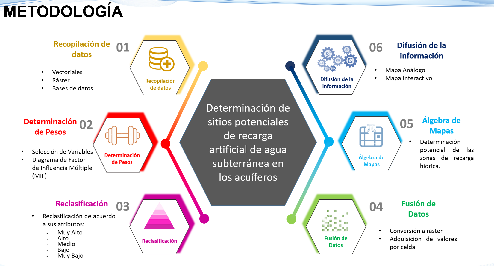
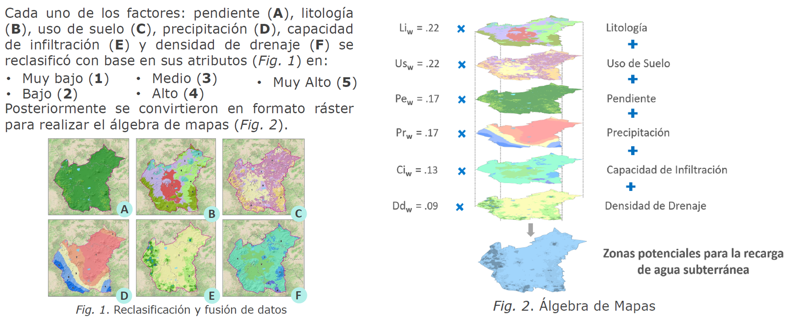
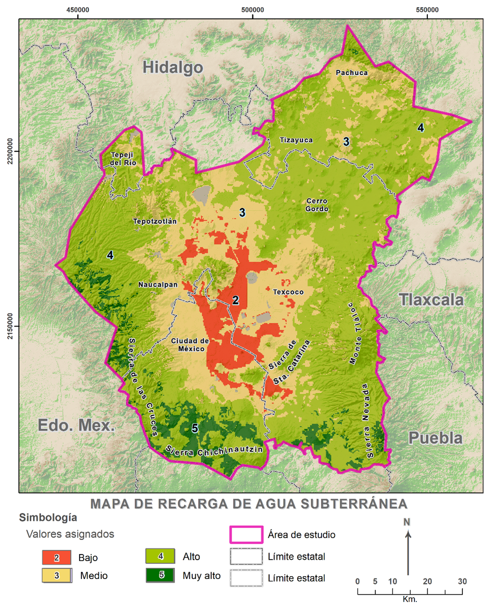

# ZMVM — Sitios potenciales de recarga artificial de agua subterránea (WebMap)

Proyecto de análisis territorial y visualización web para **identificar zonas potenciales de recarga artificial subsuperficial** en los acuíferos de la **Zona Metropolitana del Valle de México (ZMVM)**, mediante **SIG y álgebra de mapas**.  
El resultado se implementa como una **página HTML** con un **mapa interactivo desarrollado con Leaflet**.

---

## Demo (WebMap)
🔗 **Ver mapa interactivo (HTML + Leaflet):** *https://fernanda-gm.github.io/index.html*

---

## Objetivo
Determinar, mediante **álgebra de mapas**, las zonas potenciales para la **recarga artificial subsuperficial** de los acuíferos, con el fin de contribuir al **abastecimiento futuro** del recurso hídrico en la ZMVM.

---

## Contenido del WebMap (3 pestañas)
### 1) Presión Hídrica
Mapa de la República Mexicana con interacción por **Región Hidrológico-Administrativa**, mostrando:
- Grado de presión hídrica
- Volumen total de agua concesionada
- Volumen total de agua renovable

### 2) Lago de Texcoco
Visualización del proceso de desecación mediante material animado y referencia a la fuente de datos.

### 3) Mapa Interactivo (ZMVM)
Mapa de **5 acuíferos** con capas temáticas y resultado final de **potencial de recarga** (de bajo a muy alto), derivado de factores físicos y ambientales.

---

## Metodología (SIG + MIF + Álgebra de mapas)
Se integraron **seis factores**:
- Pendiente
- Uso de suelo
- Capacidad de infiltración
- Precipitación
- Densidad de drenaje
- Litología

Cada factor fue **reclasificado** en cinco categorías (muy bajo–muy alto) y ponderado mediante el enfoque de **Influencia Múltiple (MIF)**. Posteriormente, se aplicó **álgebra de mapas** para obtener el índice espacial de potencial de recarga.

  

---

## Resultado
Mapa de **zonas potenciales de recarga** clasificado por contribución a la recarga de agua subterránea.

  

---

## Hallazgos clave
- Las zonas con **muy alto potencial** se concentran principalmente en áreas de mayor elevación del piedemonte de **Sierra del Ajusco** y **Sierra de Chichinautzin** (Tlalpan y Milpa Alta), asociadas a alta permeabilidad y nivel freático profundo.
- En menor extensión, aparecen zonas favorables en **Sierra de las Cruces**, **Juchitepec**, **Amecameca de Juárez** y **Tlalmanalco**.
- La mayor parte de las áreas con potencial **alto** se ubica en **suelo de conservación**, reforzando la importancia de su protección.

---

## Conclusiones y recomendaciones
- Los **SIG** permiten evaluar regiones extensas de forma **rápida y costo-efectiva** frente a métodos convencionales.
- Se recomienda: **preservación de la masa boscosa**, prevención de **contaminación** del suelo/acuífero y fortalecimiento del **monitoreo** para la gestión hídrica.
- Para implementación: **verificación en campo** y **estudios geofísicos** previos a intervenciones.

---

## Publicación derivada
Como producto de este análisis se elaboró un **artículo** donde se describen la metodología (MIF + álgebra de mapas), el procesamiento SIG y los principales hallazgos.

🔗 **Artículo:** *https://revistaseug.ugr.es/index.php/cuadgeo/article/view/16226/21269*

---

## Tecnologías empleadas
- **Leaflet** (mapa web interactivo)
- **HTML/CSS/JavaScript** (implementación de la página)
- **SIG / Álgebra de mapas** (modelación espacial del potencial de recarga)

---

## Nota sobre datos y código
Por tratarse de un producto en desarrollo, en este repositorio se publica la **demo en vivo** y material de divulgación (GIF e imágenes), sin liberar insumos ni código fuente.

